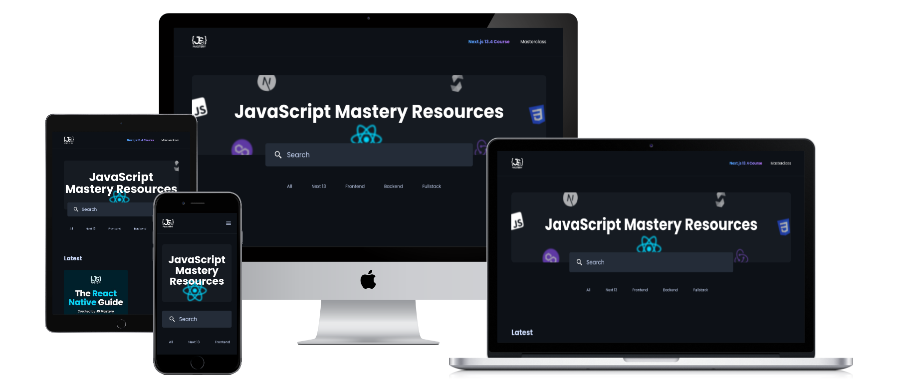

# JSM Platform landingpage

**Live Preview: [Here](https://jsm-next13-taupe.vercel.app)**

Fully responsive and modern looking landingpage.

---

**Next13 Project** made as a practice project. There is only first page in the website and all other pages are JavaScript Mastery pages. I created only home page. In this project I learned why performance is crucial and how do faster apps and improve web performance. By this project I betterment my JS,TS and Tailwind skills. 

Also I have new knowledge about:
- FCP (First Content Paint),
- LCP (Largest Content Paint)
- CLS (Cumulative Layout Shift).

## In project are used: 
- Reuseable components,
- Prefetchings,
- Responsive Web Design (RWD),
- Database with part of courses from JavaScript Mastery (where the buttons are redirecting),
- Next.js routing,

## Tools Used
1. JavaScript (Next.js 13)
2. TypeScript
3. Tailwind (Styles)
4. Sanity.io (Platform for structured content, used as database)
5. Vercel (Deployment)
6. VSCode (Code Editor)

Deploy on Vercel free,  
[Link to tutorial by JSMastery](https://www.youtube.com/watch?v=3WCIyNOrzwM)
